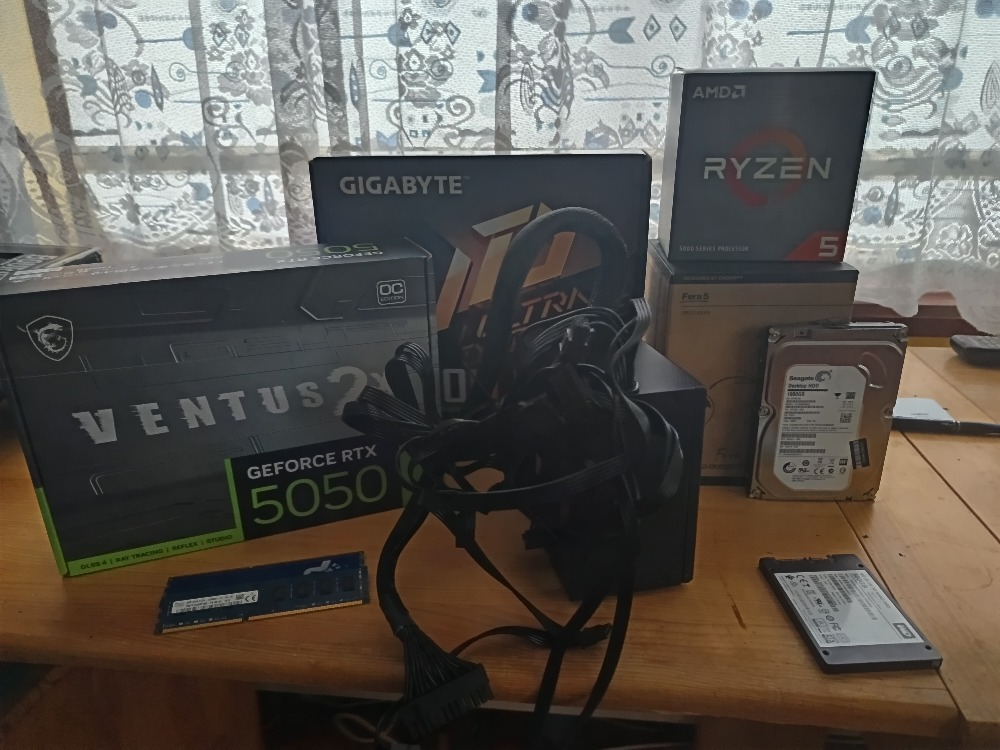
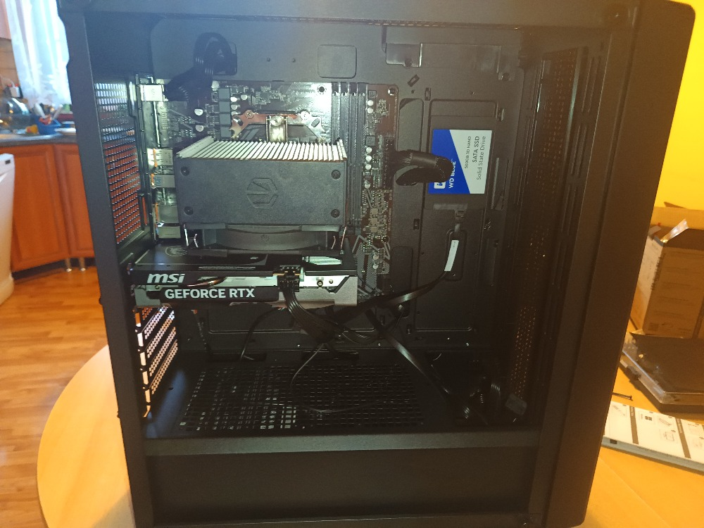

# Postup stavby počítače

  Tento dokument slouží jako detailní průvodce procesem montáže stolního počítače. Seznam použitých komponent naleznete v samostatném konfiguračním souboru.

---

## Příprava na stavbu

  Před zahájením práce je nutné připravit si vhodné nářadí. Ideální je mít po ruce dva ploché šroubováky (menší a větší) a dva křížové šroubováky. Krabici od základní desky nevyhazujte; poslouží jako bezpečná, měkká podložka pro prvotní osazování komponent. Rovněž si ponechejte veškeré drobné příslušenství dodané s deskou, jako jsou stahovací pásky či suché zipy, které později oceníte při vyvazování kabeláže.

---

## Osazení základní desky (Příprava mimo skříň)

  Prvním krokem je vybalení základní desky (MoBo). Před vyjmutím z antistatického obalu se ujistíme, že jsme se zbavili statické elektřiny dotykem uzemněného kovového předmětu, například radiátoru. Desku poté položíme na její papírovou krabici, abychom ji nepoškodili o tvrdý stůl.
  

  Následuje instalace procesoru (CPU). Ještě před vyjmutím z krabičky zkontrolujeme, zda máme připravenou teplovodivou pastu (často bývá součástí balení chladiče). Otevřeme patici na základní desce zvednutím kovové páčky. Na rohu procesoru najdeme malou zlatou šipku, kterou musíme vizuálně srovnat se značkou na rohu patice. Procesor vložíme opatrně; musí zapadnout zcela volně vlastní vahou. Nikdy na něj netlačíme silou. Pokud jsme si stoprocentně jisti správnou orientací, uzamkneme procesor v patici stlačením páčky dolů a do strany.
  

  Dalším krokem je instalace operační paměti (RAM). Vzhledem k tomu, že tato sestava využívá jeden paměťový modul, umístíme jej do slotu číslo 2 (případně dle manuálu desky pro jednokanálové zapojení). Před vložením otevřeme zámky na bocích slotu, modul orientujeme podle výřezu v kontaktech a zatlačíme, dokud zámky slyšitelně necvaknou a modul pevně neuchytí.
  

  Jakmile jsou procesor a paměti na místě, přistoupíme k montáži chladiče. Jelikož využíváme platformu AMD se socketem AM4, je nutné nejprve odšroubovat původní plastové držáky kolem procesoru a nahradit je distančními sloupky z montážní sady chladiče. Poté připevníme kovový rámeček (bracket). Na procesor naneseme teplovodivou pastu (metodou kříže nebo tečky uprostřed), odstraníme ochrannou fólii z dotykové plochy chladiče a chladič přiložíme na procesor. Šrouby utahujeme střídavě a s citem, aby byl přítlak rovnoměrný a nedošlo k poškození desky přílišným utažením.

---

## Instalace do skříně a zapojení

  Nyní přichází na řadu příprava počítačové skříně (Case). Ve spodní části skříně obvykle nalezneme svazek kabelů pro přední panel (tlačítka Power/Reset, USB, Audio) a sáček se šroubky. Nejdůležitějším prvním krokem je instalace IO shieldu (krycího plechu konektorů) do zadního výřezu skříně. Na tento krok nezapomínejte, zpětná instalace není možná bez vyjmutí desky. Následně do vnitřní stěny skříně našroubujeme distanční sloupky (spacery) přesně do míst, která odpovídají otvorům na naší základní desce.
  

  Desku opatrně vložíme do skříně tak, aby konektory zapadly do IO shieldu, a přišroubujeme ji do připravených distančních sloupků. Šrouby utahujeme pevně, aby deska nevibrovala, ale nikoliv „na krev“, abychom nepoškodili PCB desky. Ihned poté zapojíme konektory předního panelu (Power SW, Reset SW, LED diody) do příslušných pinů na desce a připojíme ventilátor chladiče procesoru do 4-pinového konektoru označeného jako CPU_FAN, který se nachází přímo u pamětí RAM a procesoru.
  

  Další fází je instalace napájecího zdroje (PSU). Zdroj vložíme do vyhrazeného prostoru (obvykle ve spodní části skříně) a přišroubujeme jej co nejpevněji, aby se nepohyboval. Pokud máte modulární zdroj, důrazně doporučuji zapojit všechny potřebné kabely do zdroje ještě před jeho vložením do skříně, protože později bude přístup velmi obtížný. Hlavní napájecí kabely (24-pin pro desku a 8-pin pro procesor) protáhneme zadní částí skříně a zapojíme do desky. Pro čistý vzhled a lepší průtok vzduchu použijte u modulárního zdroje jen ty kabely, které skutečně potřebujete.
  

  Instalace grafické karty (GPU) vyžaduje pozornost. Předtím, než se pokusíme kartu vložit, musíme odstranit záslepky (dust covers) na zadní straně skříně. Počet záslepek (obvykle dvě) a jejich pozici určíme podle umístění slotu PCIe x16 na základní desce. Pozor, u levnějších skříní jsou záslepky vylamovací – jakmile je odstraníte, nelze je vrátit zpět. Poté otevřeme plastový zámek na konci slotu PCIe x16, kartu zasuneme, dokud neuslyšíme cvaknutí pojistky, a přišroubujeme ji ke skříni. Nakonec zapojíme napájecí kabely ze zdroje. Pokud karta vyžaduje dva 8-pinové konektory, doporučuji pro stabilitu systému použít dva samostatné kabely vedené ze zdroje, nikoliv jeden rozdvojený.
  

  Posledním krokem hardwarové montáže je osazení úložiště. Pevný disk (HDD) vložíme do 3,5" šachty (racku) a zajistíme šrouby. SSD disk jsem v mém případě umístil na vnitřní stranu bočnice skříně a přišrouboval. Oba disky propojíme datovými SATA kabely se základní deskou a napájecími SATA kabely ze zdroje. Pokud máte skříň s prosklenou bočnicí a máte rádi pořádek, věnujte čas vyvázání kabelů (cable management). Zaměřte se především na kabely viditelné skrz sklo; kabely skryté pod zadní bočnicí mohou zůstat volnější, jelikož nejsou vidět.

---

## První spuštění a instalace systému

  Po kontrole všech spojů můžeme počítač zapnout. Pokud se roztočí ventilátory a systém naběhne do rozhraní BIOS, gratuluji, stavba byla úspěšná. Pokud se tak nestane, je nutné začít zpětně kontrolovat kroky (backtracking) a hledat chybu v zapojení. Pokud vše funguje, můžeme přejít k instalaci Windows.
  

  Pro instalaci budeme potřebovat USB flash disk o kapacitě alespoň 16 GB. Po zapnutí počítače vstoupíme do BIOSu, v sekci BOOT vybereme náš flash disk jako prioritní spouštěcí zařízení a uložíme nastavení. Po restartu se spustí instalátor Windows. Zde si nastavíme jazyk a periferie. V kroku výběru disku zvolíme naše SSD. Mějte na paměti, že instalace disk naformátuje a veškerá data na něm budou smazána. Doporučuji vždy formátovat disky/oddíly v rámci instalace, aby byl systém čistý.

---

## Legenda pojmů

* **GPU** – Grafická karta (Graphic Processing Unit)
* **CPU** – Procesor (Central Processing Unit)
* **MoBo** – Základní deska (Motherboard)
* **PSU** – Zdroj (Power Supply Unit)
* **HDD** – Pevný disk (Hard Disk Drive)
* **SSD** – Rychlý disk bez pohyblivých částí (Solid State Drive)

---

## Fotodokumentace

* Před začátkem stavby: 
* Po dokončení stavby: 

---

## Citace a zdroje

1. ZTT EXTRAS. *How to Build a $1,400 Gaming PC Build*. Online. 2026. Dostupné z: [YouTube](https://www.youtube.com/watch?v=QFWmvjTaJ8o).
2. LINUS TECH TIPS. *How to Build a PC, the last guide you’ll ever need!*. Online. 2024. Dostupné z: [YouTube](https://www.youtube.com/watch?v=s1fxZ-VWs2U).
3. GIGABYTE TECHNOLOGY. *B550M-K User’s Manual*. Dostupné z: [Gigabyte](https://download.gigabyte.com/FileList/Manual/mb_manual_b550m-k_e_1001.pdf).
4. GOOGLE. Gemini [online]. Verze Gemini 3 Pro. Mountain View: Google, 2026 [cit. 2026-02-11]. Dostupné z: https://gemini.google.com.
